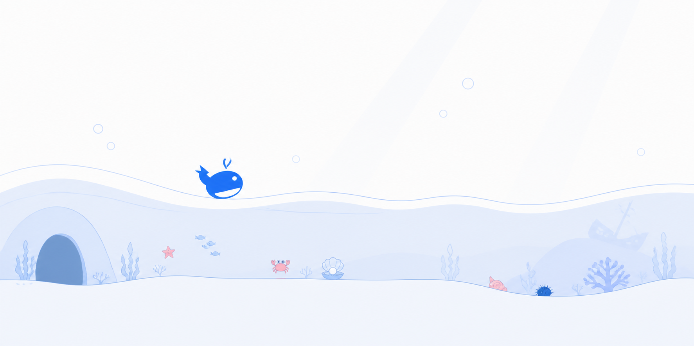

# dsh-whale-arcade

[English](README.md) | 中文

**在等待模型响应、工具执行或后台任务完成时，用三款轻量小游戏填补短暂的等待时间；随开随玩，关闭后立即回到工作，不进入会话，也不影响 Agent 继续执行。**

<p align="center">
  
</p>

浏览器本地的鲸鱼游戏中心，注册在全局 `shell.overlay` 列表中。常驻的鲸鱼按钮会打开紧凑的游戏目录；关闭时不会替换对话界面，也不会阻挡下层页面操作。

游戏中心包含「鲸鱼跃浪」「蓝鲸寻宝」和「鲸跃海岸线」。鲸鱼形象本身就是透明背景、缓慢漂浮的入口；其固定轮廓由左侧上扬尾鳍、圆润蓝色鲸身、白色弧形腹部、单眼和轻微喷水组成。三个游戏共用同一个水下视觉世界。「鲸鱼跃浪」只生成有界且可达的洞口中心变化，开口、速度和间距会逐步发展，大幅升降前也会保留更长的反应距离。「蓝鲸寻宝」为海星、小鱼、螃蟹和稀有珍珠贝设置不同分值与速度，水母和海胆则是危险物；危险比例平缓增长，七泳道抵达调度器会错开快慢物件，又不会为了避开重叠而重新抽取稀有度。「鲸跃海岸线」采用四种净空高度或宽度明确不同的实心 Canvas 轮廓：海螺、海胆、珊瑚塔和沉船残骸，并加入阶段解锁、低障碍组合以及清楚可辨的短、中、长三档间距节奏。绘图与宽松碰撞共同读取同一份像素几何，装饰性的鲸尾、喷水和障碍尖端不参与判定。三个游戏都使用逐帧运动。「鲸鱼跃浪」与「鲸跃海岸线」支持点击、触摸、空格、↑ 和 W；「蓝鲸寻宝」支持 ← →、A D 与可长按的触屏按钮。三个游戏共用开始、暂停、继续、重开、计分和本地排行榜能力。成绩保存在当前浏览器的 `localStorage` 中；每个排行榜保留十条记录，依次按分数降序、用时升序和达成时间升序排列。浏览器标签页隐藏时，正在进行的游戏会自动暂停。

本包是纯 Web Client 插件：不注册 Host 服务，不发起 RPC，不读取工作区文件，也不写入 Session 事件。

全部鲸鱼、海洋生物、障碍物和场景均在本项目中通过 SVG、CSS 或 Canvas 路径实现；安装包不包含从 DeepSeek、Flappy Bird、Chrome 或其他游戏中提取的图片、音频、字体或代码文件。

## 安装

发布后，已安装 DeepSeek Harness 的用户只需运行：

```sh
dsh plugin --profile web add dsh-whale-arcade
dsh web
```

升级或卸载：

```sh
dsh plugin --profile web update dsh-whale-arcade
dsh plugin --profile web remove dsh-whale-arcade
```

插件通过自带的 `cordis.patch.yml` 自动挂载，无需手工修改 Harness 配置。启动后打开终端显示的 Web 地址；右下角出现鲸鱼入口即表示安装成功。

## 从源码安装

当前版本随包含本目录的 DeepSeek Harness 源码分支一起构建。需要 Node.js 22.19 或更高版本；在仓库根目录依次运行：

```sh
corepack enable
corepack prepare pnpm@11.7.0 --activate
pnpm install
pnpm run build
pnpm dsh web
```

终端出现地址后，在浏览器打开 `http://127.0.0.1:3080`。再次更新源码后，只需重新运行 `pnpm install`、`pnpm run build` 和 `pnpm dsh web`。

## 模型体验

无，因为游戏中心只在浏览器本地展示，不会进入提示词、消息、工具 schema 或会话日志。

#### KV Cache 影响

无；本包不会组装或发送提供方请求。

## 已知限制与延期工作

- **排行榜仅限当前浏览器**：没有玩家身份、跨设备同步、共享排名或防作弊权威。
- **刷新后不会恢复本局**：仅保存已经完成的成绩；刷新页面后会从游戏目录开始。
